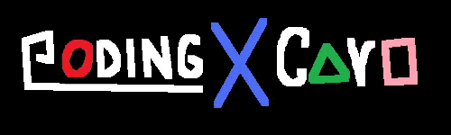

<div align="center">



<br/>

```
╔══════════════════════════════════════════════════════════╗
║                                                          ║
║   ██████╗ ██████╗ ██████╗ ██╗███╗   ██╗ ██████╗          ║
║  ██╔════╝██╔═══██╗██╔══██╗██║████╗  ██║██╔════╝          ║
║  ██║     ██║   ██║██║  ██║██║██╔██╗ ██║██║  ███╗         ║
║  ██║     ██║   ██║██║  ██║██║██║╚██╗██║██║   ██║         ║
║  ╚██████╗╚██████╔╝██████╔╝██║██║ ╚████║╚██████╔╝         ║
║   ╚═════╝ ╚═════╝ ╚═════╝ ╚═╝╚═╝  ╚═══╝ ╚═════╝          ║
║                                                          ║
║  ██╗  ██╗    ██████╗  █████╗ ██████╗ ██████╗             ║
║  ╚██╗██╔╝   ██╔════╝ ██╔══██╗██╔══██╗██╔══██╗            ║
║   ╚███╔╝    ██║  ███╗███████║██████╔╝██║  ██║            ║
║   ██╔██╗    ██║   ██║██╔══██║██╔══██╗██║  ██║            ║
║  ██╔╝ ██╗   ╚██████╔╝██║  ██║██║  ██║██████╔╝            ║
║  ╚═╝  ╚═╝    ╚═════╝ ╚═╝  ╚═╝╚═╝  ╚═╝╚═════╝             ║
║                                                          ║
╚══════════════════════════════════════════════════════════╝
```

*"Lo que parece un simple juego de cartas... nunca lo fue."*

</div>

---

> ⚠️ **ADVERTENCIA** ⚠️
>
> Este proyecto no es un demo técnico ni un ejercicio de facultad cualquiera.
> Fue concebido, desarrollado y pulido hasta obtener **dos reconocimientos formales**.
> Cada línea de código, cada textura y cada sonido tienen un propósito:
> **HACER QUE EL JUGADOR DUDE DE LA REALIDAD.**

---

## 🏆 Certificaciones Oficiales

| Insignia | Evento | Aval | Categoría |
|:---:|:---|:---|:---|
| 🥇 | Festival de Ciencias | UNET × Fundacite | Innovación en Software |
| 🏅 | Expo-Festival de Proyectos — CEDIC | UNET + instituciones de toda la ciudad | Desarrollo de Videojuego |

> Dos certificados no mienten. Este proyecto dejó huella antes de salir al mundo.

---

## 🜁 La Premisa

Al principio todo es familiar. Un tablero. Cartas. Turnos. Estrategia.

Te sientes seguro.

Pero la partida se tuerce. La pantalla se fractura. Las reglas colapsan. Y cuando abres los ojos ya no hay mesa, ni mazo, ni rival frente a ti. Solo un escenario tridimensional, abandonado, cargado de una atmósfera que pesa.

**No es un error. Es el diseño.**

Coding X Card es un experimento que rompe la cuarta pared del género: un mismo ejecutable que te arrastra desde un juego de cartas 2D hasta una experiencia de exploración en primera persona. El cambio de paradigma no es un menú ni una cinemática: es la mecánica central.

- **Fase 1** — Lo conocido. Lo cómodo. La calma antes del abismo.
- **Fase 2** — El despertar. Nadie te avisó que esto iba a pasar.

---

## 🕳️ El Descenso

```
┌──────────────────────────────────────────────────────┐
│                                                      │
│    [ FASE 1 ]  Juego de cartas 2D por turnos         │
│                      │                               │
│                      ▼  algo se quiebra              │
│                      │                               │
│    [ FASE 2 ]  Entorno 3D. Abandonado. Tétrico.      │
│                      │                               │
│                      ▼  el escape es la única ruta   │
│                      │                               │
│    [ VICTORIA ]      o      [ ¿HAY ALGO MÁS? ]       │
│                                                      │
└──────────────────────────────────────────────────────┘
```

La transición no está escondida en un nivel secreto: ocurre frente a tus ojos, sin aviso, como un bug que en realidad es la puerta de entrada al horror. El jugador no elige cambiar de fase: **la fase lo elige a él.**

---

## 💀 Lo que lo hace Brutal

| Elemento | Por qué importa |
|:---|:---|
| **El Giro** | No hay botón de "siguiente nivel": la ruptura 2D → 3D es narrativa, visual y mecánica |
| **Motor de cartas propio** | Lógica de turnos, reglas y condiciones de victoria escritas desde cero en GDScript |
| **Exploración en primera persona** | Movimiento fluido con salto, sprint e interacción con objetos en un mundo decadente |
| **Dirección de arte única** | Shaders personalizados, iluminación tétrica, menús animados y diseño sonoro original |
| **Arquitectura limpia** | Escenas, scripts, shaders y assets 100% desacoplados. Modular por necesidad, no por moda |

> No estás solo. Y lo que habita aquí no juega a las cartas.

---

## 🛠️ Arsenal Técnico

- **Motor:** Godot Engine 4.4 (GL Compatibility)
- **Lenguaje:** GDScript
- **Assets:** Sprites 2D · Modelos 3D · Audio original · Shaders GLSL
- **Control de versiones:** Git + GitHub

Cada herramienta fue elegida para servir al concepto, no al revés. Godot 4.4 proporciona el renderizado necesario para que el quiebre visual sea creíble, y GDScript permite iterar rápido sobre las mecánicas sin sacrificar control.

---

## 📂 Anatomía del Repositorio

```
Coding-X-Card/
│
├── 🎵 Audio/         ← Música y SFX que construyen la atmósfera
├── 🎬 Escenas/       ← Nivel principal, flujo de juego y transiciones
├── 📦 Extras/        ← Recursos complementarios y documentación interna
├── 🖥️  Menus/         ← UI completa: menú principal, pausa, game over
├── 🧊 Modelos/       ← Assets 3D del entorno tétrico
├── 🔤 rainyhearts/   ← Tipografía personalizada
├── 🧩 Scenes/        ← Escenas reutilizables y prefabs
├── 📜 Scrips/        ← Toda la lógica escrita en GDScript
├── 🌀 Shaders/       ← Shaders personalizados para efectos visuales
├── 🃏 Sprites/       ← Gráficos 2D (cartas, iconos, texturas de UI)
├── 🗺️  Texturas/      ← Materiales y texturas del mundo 3D
└── ⚙️  project.godot  ← Configuración raíz del motor
```

> Los directorios `.godot/`, `.import` y los archivos `.uid` son generados automáticamente. No los toques.

---

## 🚀 Puesta en Marcha

```bash
# 1. Clona el repositorio
git clone https://github.com/JuanD-2005/CARD-POCALIPSIS.git

# 2. Abre Godot Engine 4.4 o superior
# 3. Importa el proyecto seleccionando el archivo project.godot
# 4. Presiona ▶ Play (o F5)
```

> **Requisito:** Godot 4.4+. No requiere plugins externos ni dependencias adicionales.

---

## 🎮 Controles

| Acción | Tecla / Botón |
|:---|:---:|
| Moverse | `W` `A` `S` `D` |
| Saltar | `Espacio` |
| Sprint | `Shift` |
| Interactuar | `E` |
| Pausa | `Esc` |
| Seleccionar carta | `Click Izquierdo` |

---

## 📍 Estado

```
▓▓▓▓▓▓▓▓▓▓▓▓▓▓▓▓▓▓▓▓░░  85 %   — En desarrollo activo.
                             Mecánicas, atmósfera y pulido en refinamiento continuo.
                             La visión está clara. El resultado, cada vez más cerca.
```

---

<div align="center">

```
        ▄▄▄▄▄▄▄▄▄▄▄▄▄▄▄▄▄▄▄▄▄▄▄▄▄▄▄▄▄▄▄▄▄▄▄▄▄▄▄▄▄▄▄▄▄▄
        █                                            █
        █   DESARROLLADO CON OBSESIÓN, CARTAS Y CAFÉ █
        █                                            █
        █      JuanD-2005     ·     JoseABravoD      █
        █                                            █
        █   github.com/JuanD-2005                    █
        █   github.com/JoseABravoD                   █
        █                                            █
        ▀▀▀▀▀▀▀▀▀▀▀▀▀▀▀▀▀▀▀▀▀▀▀▀▀▀▀▀▀▀▀▀▀▀▀▀▀▀▀▀▀▀▀▀▀▀
```

*¿Cartas o exploración? Estrategia o terror. Orden o caos.*

**Aquí no eliges. Aquí sobrevives.**

</div>