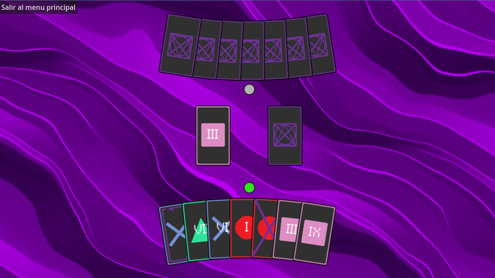
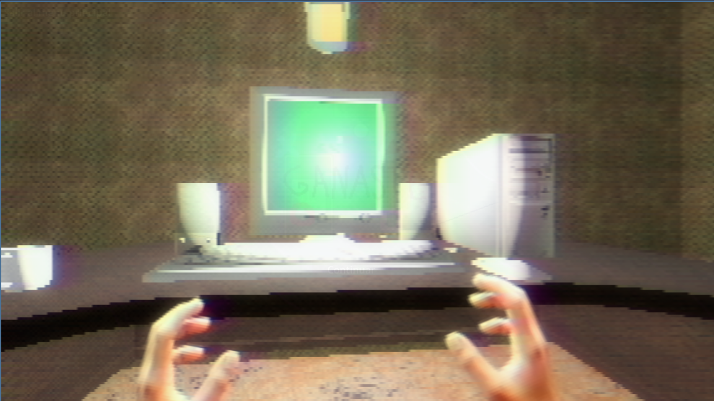
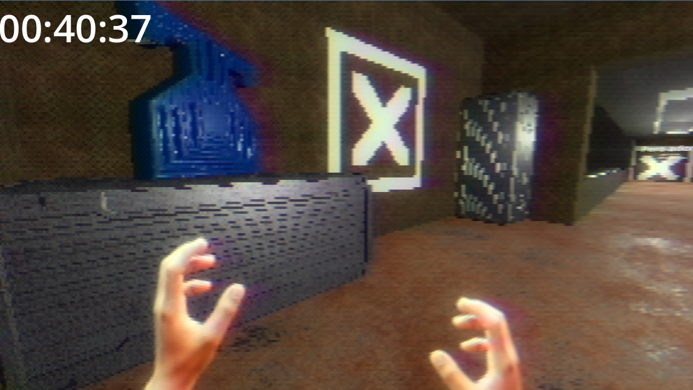
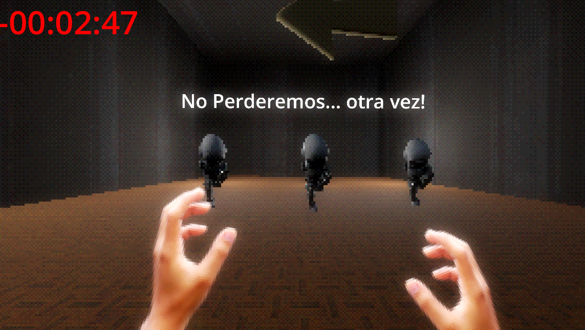

<div align="center">


<br/>

> *Lo que parece un juego de cartas... no lo es.*

<br/>

[](https://godotengine.org/)
[](https://docs.godotengine.org/en/stable/tutorials/scripting/gdscript/)
[](https://www.unet.edu.ve/)

<br/>



</div>

---

## ¿Qué es Coding X Card?

Empieza como un juego de cartas por turnos —tranquilo, familiar, casi aburrido.

Entonces **algo cambia.**

El mundo se quiebra. La pantalla colapsa. Y de repente estás solo, en un escenario 3D tétrico y abandonado, donde las reglas ya no son las de un mazo de cartas. Aquí, para ganar, tienes que avanzar. Explorar. Escapar.

**Coding X Card** es un experimento de diseño: ¿qué pasa cuando mezclas dos géneros radicalmente distintos en un solo ejecutable, y el cambio entre ellos es la mecánica?

<br/>

<div align="center">



</div>

---

## 🏆 Reconocimientos

Este proyecto fue desarrollado desde cero para una feria académica y ha recibido reconocimiento formal en dos eventos institucionales:

<br/>

<div align="center">

| 🥇 | Evento | Institución |
|:---:|:---|:---|
| 🎖️ | **Festival de Ciencias** | UNET × Fundacite |
| 🏅 | **Expo-Festival de Proyectos — CEDIC** | UNET — con participación de instituciones educativas de toda la ciudad |

</div>

<br/>

<div align="center">



</div>

---

## ✨ Lo que lo hace diferente

```
[ FASE 1 ]  Juego de cartas 2D por turnos
                ↓  algo sale mal
[ FASE 2 ]  Mundo 3D. Abandonado. Tétrico.
                ↓  el escape es la única salida
[ VICTORIA ]
```

| Característica | Descripción |
|:---|:---|
| **El Giro** | La transición de 2D a 3D no es un menú — es parte del juego |
| **Lógica de cartas** | Sistema de turnos y reglas implementado desde cero en GDScript |
| **Movimiento 3D** | Primera persona con salto, sprint e interacción |
| **Estética propia** | Shaders personalizados, menús animados y diseño de sonido original |
| **Arquitectura modular** | Escenas, scripts, shaders y assets completamente separados |

<br/>

<div align="center">



</div>

---

## 🛠️ Stack técnico

- **Motor:** [Godot Engine 4.4](https://godotengine.org/) — GL Compatibility
- **Lenguaje:** GDScript
- **Assets:** Sprites 2D, modelos 3D, audio y shaders personalizados

---

## 📂 Estructura del repositorio

```
Coding-X-Card/
├── 🎵 Audio/         — Música y efectos de sonido
├── 🎬 Escenas/       — Nivel principal y transiciones
├── 📦 Extras/        — Recursos y archivos adicionales
├── 🖥️  Menus/         — Interfaz de usuario y menús
├── 🧊 Modelos/       — Modelos 3D del entorno
├── 🔤 rainyhearts/   — Fuentes tipográficas
├── 🧩 Scenes/        — Escenas secundarias y prefabs
├── 📜 Scrips/        — Lógica del juego en GDScript
├── 🌀 Shaders/       — Shaders personalizados
├── 🃏 Sprites/       — Recursos gráficos 2D (cartas y UI)
├── 🗺️  Texturas/      — Materiales para el entorno 3D
└── ⚙️  project.godot  — Configuración raíz del motor
```

> Los archivos `.godot/`, `.import` y `.uid` son generados automáticamente por Godot. No requieren edición manual.

---

## 🚀 Cómo ejecutarlo

```bash
# 1. Clona el repositorio
git clone https://github.com/JuanD-2005/CARD-POCALIPSIS.git

# 2. Abre Godot Engine 4.4 o superior
# 3. Importa el proyecto seleccionando project.godot
# 4. Presiona ▶ Play
```

---

## 🎮 Controles

| Acción | Tecla |
|:---|:---:|
| Moverse | `W` `A` `S` `D` |
| Saltar | `Space` |
| Sprint | `Shift` |
| Interactuar | `E` |
| Pausa | `Esc` |
| Seleccionar carta | `Click izquierdo` |

---

## 📌 Estado del proyecto

> **En desarrollo activo.** Mecánicas, flujo de juego y pulido visual en refinamiento continuo.

---

<div align="center">

Desarrollado con 🃏 y demasiado café por

**[JuanD-2005](https://github.com/JuanD-2005)** · **[JoseABravoD](https://github.com/JoseABravoD)**

<br/>

*¿Cartas o exploración? Ambas. Ninguna. Tú decides.*

</div>